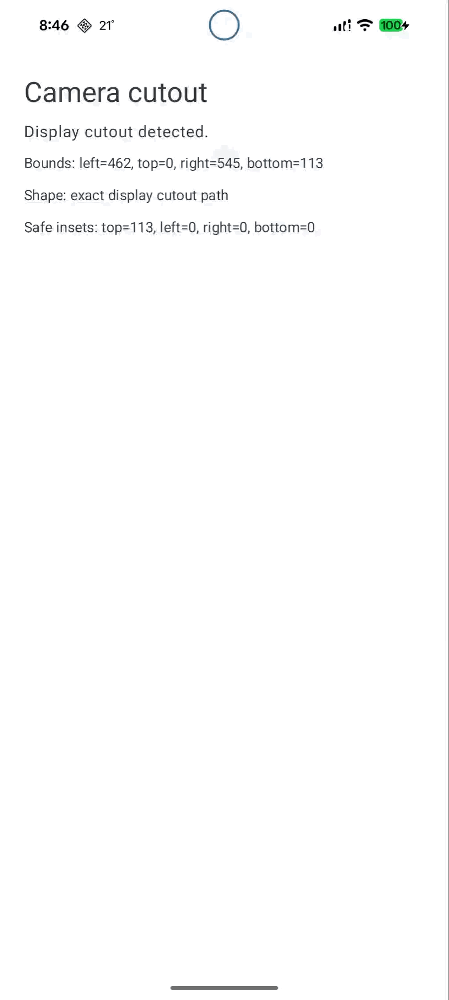

# Android Camera Cutout

A lightweight Android 12+ Jetpack Compose library for detecting display camera cutouts, tracing notch/hole-punch shapes, and rendering customizable cutout overlays and animations.

## Status

Early extraction from Momentarium. The API is usable, but may change before `1.0.0`.

## Features

- Reads Android `DisplayCutout` information from window insets.
- Uses the exact `cutoutPath` when available.
- Falls back to an oval inside the cutout bounds.
- Draws a configurable overlay around the camera cutout.
- Optionally emits a filled copy of the cutout shape once or infinitely.
- Emits app-provided Compose content from the detected cutout.
- Includes a debug route and sample app for quick device verification.

## Requirements

- Android 12+ / API 31+
- Jetpack Compose

## Sample Usage

```kotlin
window.enableCameraCutoutLayout()
enableEdgeToEdge()

setContent {
    MaterialTheme {
        CameraCutoutDebugRoute(
            emissionConfig = CameraCutoutEmissionConfig(
                enabled = true,
                travelPx = 300f,
                durationMillis = 3000,
                repeatMode = CameraCutoutEmissionRepeatMode.Infinite,
            ),
        )
    }
}
```

This configuration emits a filled copy of the detected cutout, moves it 300 px downward over 3000 ms, fades it after reaching the destination, and repeats indefinitely.



## Custom Printed Content

Use `CameraCutoutContentEmissionOverlay` when the app should provide the emitted content, such as a photo, card, QR code, or receipt-style view.

```kotlin
Box(modifier = Modifier.fillMaxSize()) {
    AppContent()

    CameraCutoutContentEmissionOverlay(
        modifier = Modifier.fillMaxSize(),
        emissionConfig = CameraCutoutEmissionConfig(
            enabled = true,
            travelPx = 300f,
            durationMillis = 3000,
            repeatMode = CameraCutoutEmissionRepeatMode.Infinite,
        ),
    ) {
        Image(
            painter = painterResource(R.drawable.printed_photo),
            contentDescription = null,
            modifier = Modifier
                .width(120.dp)
                .aspectRatio(0.75f),
        )
    }
}
```

The library handles cutout detection, origin placement, travel timing, and fade timing. The app owns the content that appears to print from the notch.

## Modules

- `camera-cutout`: the reusable library.
- `sample`: a small app that demonstrates the cutout overlay on real devices.

## License

MIT
